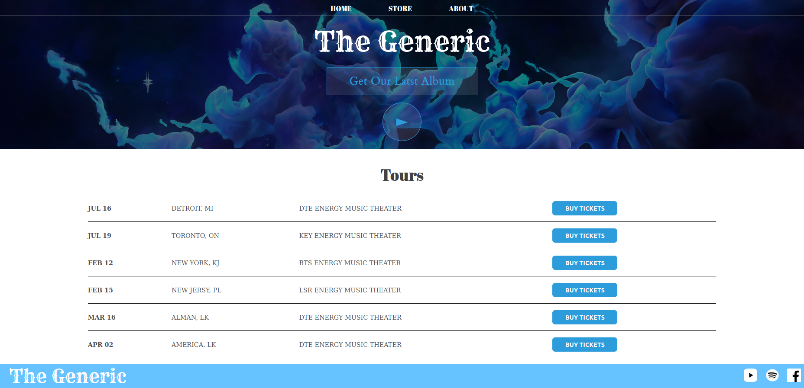
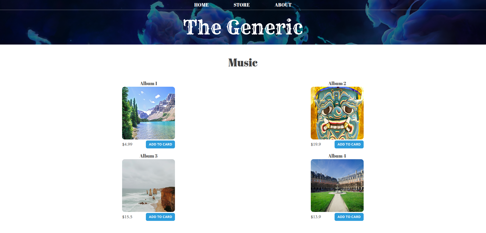
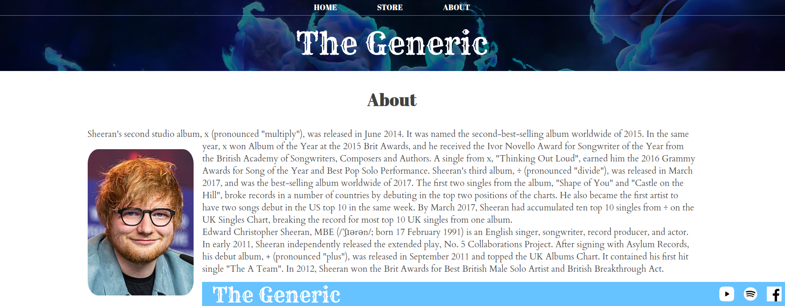

# HTML CSS Source Code

Here is a HTML CSS source code that I learned from a youtube tutorials.\
I will show you guys pages that created down here.

## Index.html Page

## Store.html Page

## About.html Page

## Why?
I'm not a professional guy on creating awesome pages and perfect designs, just about a yeat ago wanted to try creating Html Css pages.\
So just found an awesome youtube video and started creating.\
And that's it.\
Hope I had that video to mention but I don't.\
If anyone knows which youtube video this is, tell me as an issue to mention it.